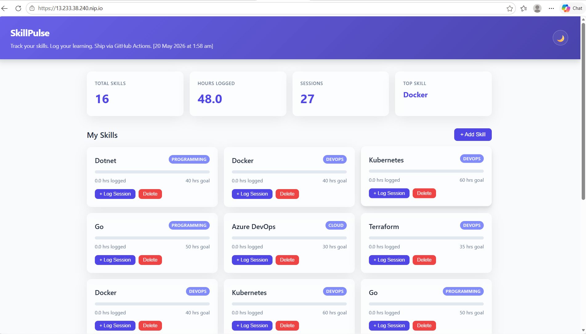
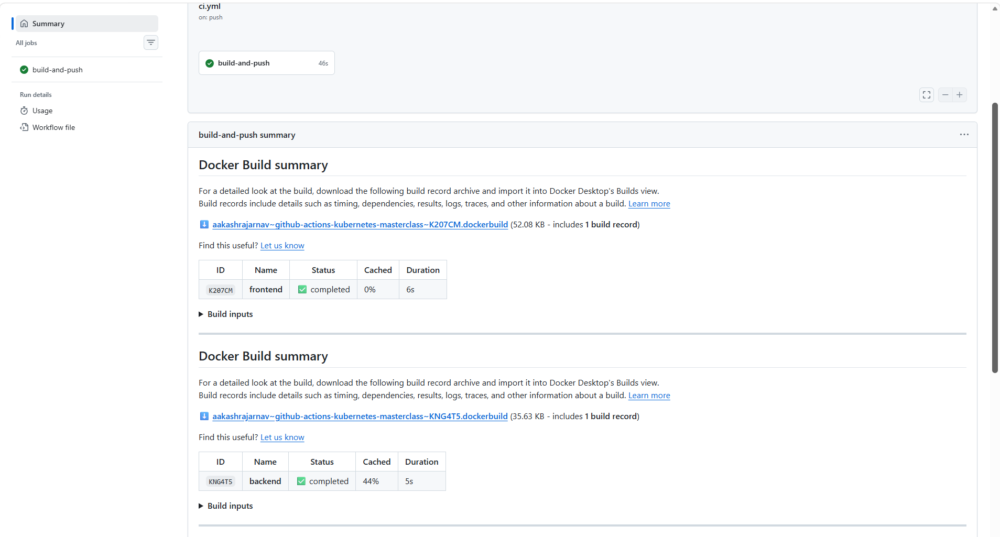
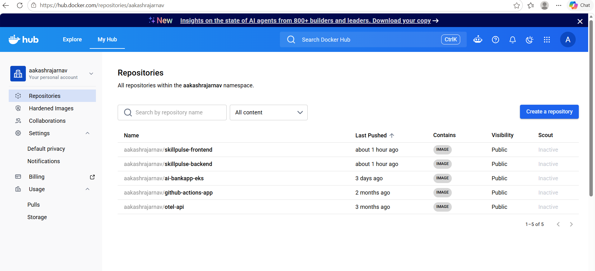
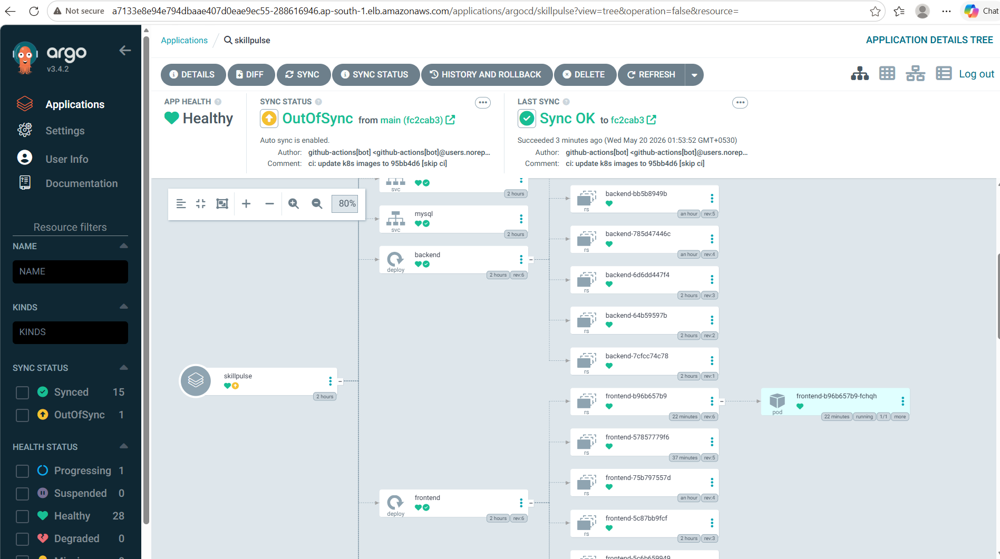
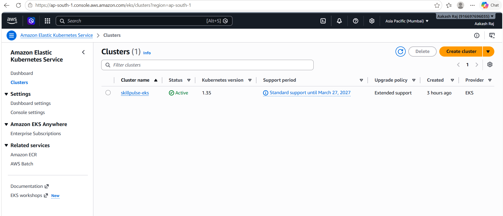
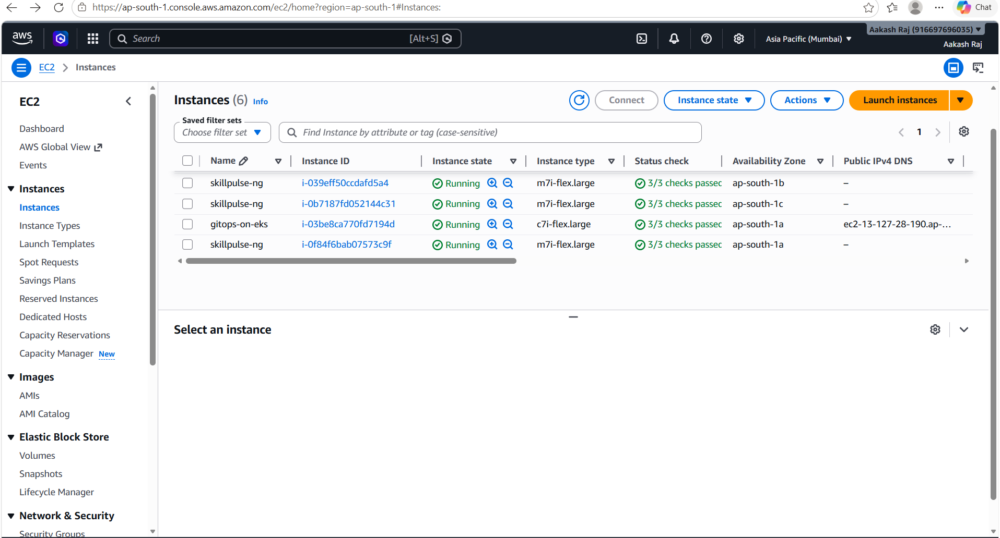
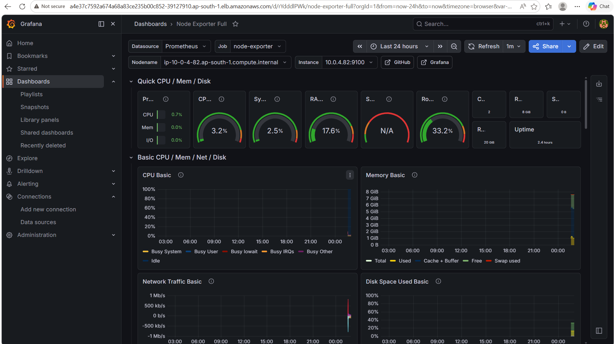
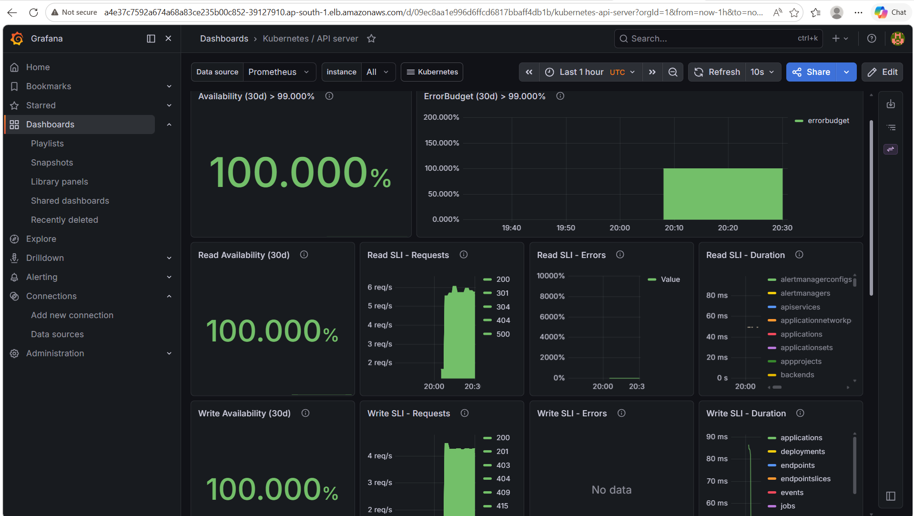

# SkillPulse — GitHub Actions & Kubernetes Masterclass

A small, real application with a real CI/CD pipeline. The app — **SkillPulse** — lets you track skills you're learning and the hours you put in. The point isn't the app. The point is everything around it: how a single `git push` becomes a running update on a Kubernetes cluster in under two minutes, with no human pressing any button.

This repo is the working demo for the **TrainWithShubham GitHub Actions & Kubernetes Masterclass**.

> **New here? Two beginner-friendly companion guides:**
>
> - [`docs/skillpulse-cicd-guide.pdf`](docs/skillpulse-cicd-guide.pdf) — chapter one. 29 pages on the GitHub Actions pipeline: DevOps foundations, CI/CD, containers, deploying to a real EC2, plus resume + interview prep.
> - [`docs/skillpulse-kubernetes-guide.pdf`](docs/skillpulse-kubernetes-guide.pdf) — chapter two. 32 pages on running this app on a local `kind` cluster: Kubernetes primitives, manifest walkthrough, the dev loop, real failures we hit (arch mismatches, port collisions), interview prep.

---

## Live Infrastructure

Everything below is running on AWS `ap-south-1` (Mumbai):

| Component | Details |
|---|---|
| **EKS Cluster** | `skillpulse-eks`, Kubernetes v1.35, Active |
| **Worker Nodes** | 3x `skillpulse-ng` (m7i-flex.large) + 1 `gitops-on-eks` (c7i-flex.large) |
| **GitOps** | ArgoCD — App Healthy, auto-sync enabled |
| **Docker Hub** | `aakashrajarnav/skillpulse-frontend` and `aakashrajarnav/skillpulse-backend` |
| **Observability** | Grafana + Prometheus (Node Exporter + Kubernetes API Server) |

---

## Screenshots

### SkillPulse App — Live on EKS

> Track skills, log sessions, hit your hour goals.



---

### GitHub Actions — CI Build

> Every `git push` to `main` triggers the CI pipeline. Both `frontend` and `backend` images are built and pushed to Docker Hub in under 60 seconds.



---

### Docker Hub — Image Registry

> Built images are pushed to public Docker Hub repositories tagged with both `:latest` and the commit SHA for precise rollbacks.



---

### ArgoCD — GitOps Deployment

> ArgoCD watches the `main` branch. When CI bumps the image tag in the manifests, ArgoCD detects the drift and auto-syncs the cluster — zero manual `kubectl apply`.



---

### AWS EKS — Cluster

> A managed Kubernetes 1.35 cluster in `ap-south-1`, provisioned via Terraform.



---

### AWS EC2 — Worker Nodes

> Three `skillpulse-ng` worker nodes spread across availability zones (ap-south-1a, 1b, 1c) plus a dedicated GitOps node for ArgoCD.



---

### Grafana — Node Metrics (Node Exporter Full)

> Prometheus scrapes all nodes. CPU at 3.2%, memory at 17.6%, disk at 33.2% — healthy headroom across the board.



---

### Grafana — Kubernetes API Server SLOs

> 100.000% read and write availability over the 30-day window. Error budget fully intact.



---

## Architecture

```
Developer
    |
    |  git push to main
    v
GitHub Repository
    |
    |  on: push (main)
    v
+---------------------------------------------+
|  CI Workflow  (.github/workflows/ci.yml)    |
|  1. Checkout code                           |
|  2. Build frontend + backend Docker images  |
|  3. Tag with :sha and :latest               |
|  4. Push to Docker Hub                      |
|  5. Bump image tag in k8s/ manifests        |
|  6. Commit [skip ci] back to main           |
+---------------------------------------------+
                    |
                    |  ArgoCD detects manifest drift
                    v
+---------------------------------------------+
|  ArgoCD (running in EKS)                   |
|  Auto-syncs k8s/ manifests                 |
|  Rolling update, zero downtime             |
+---------------------------------------------+
                    |
                    v
+---------------------------------------------+
|  EKS Cluster: skillpulse-eks               |
|  Namespace: skillpulse                     |
|  +----------+  +----------+  +---------+  |
|  | frontend |  | backend  |  |  mysql  |  |
|  |(Deployment) |(Deployment) |(StatefulSet)|
|  +----------+  +----------+  +---------+  |
+---------------------------------------------+
                    |
                    v
       Prometheus + Grafana
       (Node metrics + k8s SLOs)
```

---

## Why DevOps matters

For most of software's history, the people who *wrote* software and the people who *ran* it were two different teams with two different goals.

- Developers wanted to ship features.
- Operations wanted stability.

The fastest way for ops to be stable was to slow developers down. The fastest way for developers to ship was to throw code over the wall. Both teams were right. Both teams were also miserable. The customer paid the price — releases happened once a quarter, every release was scary, bugs took weeks to fix.

DevOps is the cultural and technical answer to that: *the same team owns the change all the way to production, and tooling makes that safe.*

When DevOps is working you can tell because:

- **Deploys are boring.** Friday afternoon, Monday morning, doesn't matter.
- **Rollbacks are cheap.** A bad deploy is a 30-second fix, not an incident.
- **Feedback is fast.** A broken commit fails CI in minutes, not "after QA next sprint."
- **Ownership is clear.** The person who wrote the code is the person who watches it ship.

---

## Why CI/CD is the heart of DevOps

CI/CD is two ideas wearing one acronym.

- **Continuous Integration** — every change gets built and tested automatically the moment it lands. You catch breakage in minutes, not days.
- **Continuous Deployment** — every change that passes CI is automatically packaged and shipped to production. There is no "deploy day." Every commit is a candidate release.

The only way to make it work is to *automate everything*. Build, test, package, deploy, verify. If a human has to remember a step, it will eventually be forgotten — and then it will fail at 2 a.m.

---

## CI Pipeline — `.github/workflows/ci.yml`

Triggered on every push to `main`. Steps:

1. **Checkout** — fresh clone in a clean Ubuntu runner, no laptop state to leak.
2. **Build two Docker images** — Go backend and Nginx-served frontend, both multi-stage for small final images.
3. **Tag each image twice** — with the commit SHA (`:abc1234`) for rollback precision, and `:latest` for production pulls.
4. **Push to Docker Hub** — authenticated with secrets, never plaintext credentials in the repo.
5. **Bump manifests** — updates the image tag in `k8s/20-backend.yaml` and `k8s/30-frontend.yaml`, commits back to `main` with `[skip ci]` to prevent infinite loops.

From the latest run: `frontend` built in **6s**, `backend` in **5s** (44% cache hit). Total job: **46s**.

---

## CD Pipeline — GitOps with ArgoCD

Rather than SSH-deploying directly, CD follows the **GitOps** pattern:

```
git push
  -> CI builds + pushes images to Docker Hub
  -> CI bumps image tag in k8s manifests, commits to main
  -> ArgoCD detects drift (OutOfSync)
  -> ArgoCD auto-syncs -> rolling update in EKS
  -> App healthy
```

**Loop protection:** manifest-update commits include `[skip ci]` so CI ignores them. ArgoCD only reconciles when there is actual drift.

### Secrets required

| Secret | What it is |
|---|---|
| `DOCKERHUB_USERNAME` | Docker Hub account name |
| `DOCKERHUB_TOKEN` | Docker Hub Personal Access Token (read + write) |
| `EC2_HOST` | Public IP or DNS of EC2 deploy target (docker-compose path) |
| `EC2_USER` | Linux user on EC2, typically `ubuntu` |
| `EC2_SSH_KEY` | Full contents of the `.pem` private key |

Set at `Settings -> Secrets and variables -> Actions` on your fork.

---

## The Application

A three-tier app — kept small so the pipeline is the star.

| Tier | Tech | What it does |
|---|---|---|
| Frontend | HTML + CSS + vanilla JS, served by Nginx | UI for adding skills and logging hours |
| Backend | Go 1.26 + Gin | REST API at `/api/...` |
| Database | MySQL 8.4 | Stores skills and learning logs |

Nginx reverse-proxies `/api/` and `/health` to the backend, so the public surface is a single port (`80`).

**Live stats (May 20 2026):**

| Stat | Value |
|---|---|
| Total Skills | 16 |
| Hours Logged | 48.0 |
| Sessions | 27 |
| Top Skill | Docker |

### API Surface

```
GET    /api/skills              list skills + total hours
POST   /api/skills              create skill
GET    /api/skills/:id          one skill + its logs
DELETE /api/skills/:id          delete skill (cascades logs)
POST   /api/skills/:id/log      log a study session
GET    /api/dashboard           summary counters
GET    /health                  DB ping for healthchecks
```

---

## Run Locally (Docker Compose)

```bash
cp .env.example .env             # fill in DOCKERHUB_USERNAME
docker compose up -d --build
# open http://localhost
docker compose down -v           # -v drops the MySQL volume too
```

Backend port 8080 is not exposed directly — all traffic goes through Nginx, exactly like production.

---

## Run on Kubernetes (kind — local)

Same app, same images — but with real Kubernetes primitives: namespace, deployment, service, statefulset, configmap, secret, pvc.

**Prerequisites:** Docker Desktop running + `brew install kind kubectl`

```bash
make up        # creates kind cluster + applies manifests -> http://localhost:8888
make down      # deletes cluster + MySQL data
make restart   # rebuild images, reload into cluster, roll deployments
make status    # one-screen view of pods, services, endpoints
make logs      # tail all three workloads
make mysql     # open mysql shell in the StatefulSet pod
```

### Traffic flow

```
localhost:8888
    | kind extraPortMappings: hostPort 8888 -> nodePort 30080
    v
Service frontend (NodePort 30080)
    v
Deployment frontend (nginx + static files)
    | proxy_pass http://backend:8080
    v
Service backend (ClusterIP 8080)
    v
Deployment backend (Go + Gin)
    | DB_HOST=mysql
    v
Service mysql (Headless 3306)
    v
StatefulSet mysql + 1Gi PVC + init.sql ConfigMap
```

### Manifest layout

```
k8s/
  kind-config.yaml    1 control-plane + 2 workers, host 8888 -> node 30080
  00-namespace.yaml   namespace: skillpulse
  10-mysql.yaml       Secret + ConfigMap + headless Service + StatefulSet + PVC
  20-backend.yaml     Deployment + ClusterIP Service + /health probes
  30-frontend.yaml    Deployment + NodePort Service (30080)
```

### Smoke test

```bash
curl http://localhost:8888/health          # {"status":"healthy"}
curl http://localhost:8888/api/dashboard   # seed-data counters
curl -s http://localhost:8888/ | grep '<title>'   # SkillPulse
```

---

## Deploy to EKS with ArgoCD (Production)

### What changes from kind to EKS

| Aspect | kind (local) | EKS + ArgoCD |
|---|---|---|
| Cluster | Local Docker nodes | AWS-managed control plane + EC2 workers |
| Image source | `kind load docker-image` | Pull from Docker Hub |
| Deploy trigger | `make apply` manually | ArgoCD auto-sync on git commit |
| Nodes | 1 control-plane + 2 workers | 3 workers across 3 AZs |
| Observability | None | Prometheus + Grafana |

### EKS Cluster Details

```
Cluster:   skillpulse-eks
Region:    ap-south-1 (Mumbai)
Version:   Kubernetes 1.35
Status:    Active
Support:   Standard support until March 27, 2027
```

### Worker Nodes

| Name | Instance ID | Type | AZ |
|---|---|---|---|
| skillpulse-ng | i-039eff50ccdafd5a4 | m7i-flex.large | ap-south-1b |
| skillpulse-ng | i-0b7187fd052144c31 | m7i-flex.large | ap-south-1c |
| skillpulse-ng | i-0f84f6bab07573c9f | m7i-flex.large | ap-south-1a |
| gitops-on-eks | i-03be8ca770fd7194d | c7i-flex.large | ap-south-1a |

### ArgoCD Setup

```bash
# Install ArgoCD into the cluster
kubectl create namespace argocd
kubectl apply -n argocd -f https://raw.githubusercontent.com/argoproj/argo-cd/stable/manifests/install.yaml

# Apply the Application manifest from this repo
kubectl apply -f argocd/application.yaml
```

ArgoCD watches `k8s/` on the `main` branch. When CI commits a tag bump, ArgoCD reconciles within seconds.

---

## Observability

### Node Metrics — Grafana + Node Exporter

Worker node `ip-10-0-4-82.ap-south-1.compute.internal` at healthy low utilisation:

| Metric | Value |
|---|---|
| CPU utilisation | 3.2% |
| Memory used | 17.6% |
| Root filesystem used | 33.2% |
| Uptime | 2.4 hours |
| Total RAM | 8 GiB |

### Kubernetes API Server SLOs — 30-day window

| SLO | Value |
|---|---|
| Overall availability | 100.000% |
| Read availability | 100.000% |
| Write availability | 100.000% |
| Error budget remaining | > 99.000% — fully intact |

---

## Project Layout

```
.github/workflows/
  ci.yml              build + push images, bump k8s manifests
  cd.yml              SSH + docker compose deploy (EC2 path)
  cd-k8s.yml          manifest bump + commit (GitOps/EKS path)

backend/              Go service (multi-stage Dockerfile)
  main.go
  database/db.go      MySQL connection with retry loop
  handlers/           skills, logs, dashboard endpoints
  models/             request/response structs

frontend/             Nginx + static HTML/CSS/JS (multi-stage Dockerfile)
  nginx.conf          serves site, proxies /api/ to backend:8080

mysql/
  init.sql            schema + seed data

k8s/                  Kubernetes manifests                   
  00-namespace.yaml   
  10-mysql.yaml
  20-backend.yaml
  30-frontend.yaml
  cert-manager.yml
  gateway.yml
  secrets.yml

argocd/               ArgoCD Application manifest

terraform/            EKS cluster provisioning (HCL)
  .terraform.lock.hcl
  argocd.tf
  eks.tf
  outputs.tf
  provider.tf
  terraform.tfvars
  variables.tf
  vpc.tf

k8s/
  00-namespace.yaml
  10-mysql.yaml
  20-backend.yaml
  30-frontend.yaml
  cert-manager.yml
  gateway.yml
  secrets.yml
screenshots/          Infrastructure screenshots (referenced in this README)
docker-compose.yml
.env.example
Makefile
```

---

## Fork and Run

1. Fork this repo and clone locally.
2. Add secrets: `DOCKERHUB_USERNAME`, `DOCKERHUB_TOKEN` (plus EC2 secrets if using the docker-compose path).
3. Set repo variable `DEPLOY_ENABLED = "true"` under `Settings -> Variables -> Actions`.
4. Push any code change — watch the Actions tab as CI builds, pushes images, and bumps manifests.
5. ArgoCD picks up the manifest change and syncs the cluster automatically.

For the local kind path: `make up` then open `http://localhost:8888`.

---

## Gotchas worth knowing

- **Docker Desktop must be running** for kind builds and `kubectl`.
- **First boot is slow** — the PVC provisioner needs time before MySQL starts. Expect 10-30s of `Pending`.
- **Host port collision** — if something owns port 8888, change `hostPort` in `k8s/kind-config.yaml` and re-run `make down && make up`.
- **`[skip ci]` on manifest commits** — this is intentional loop protection. CI ignores those commits.
- **`DEPLOY_ENABLED` variable** — leave it unset to build without pushing (safe dry-run mode for forks).

---

## Credits

Built ❤️ for the [TrainWithShubham](https://www.youtube.com/@TrainWithShubham) community. If this repo helped you understand a real CI/CD pipeline end to end, ⭐ Star this repo
